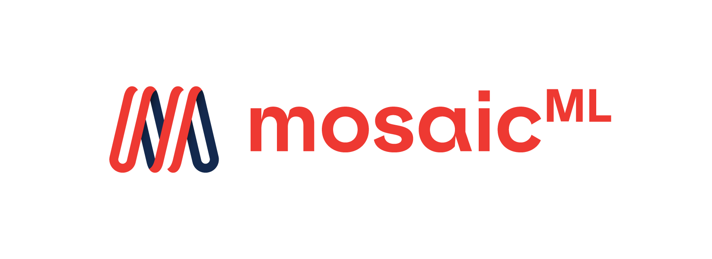
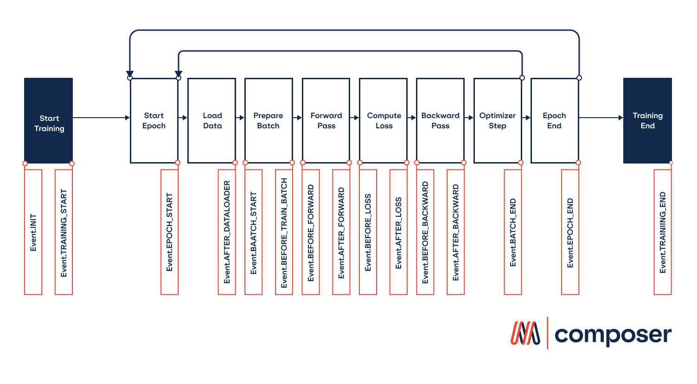
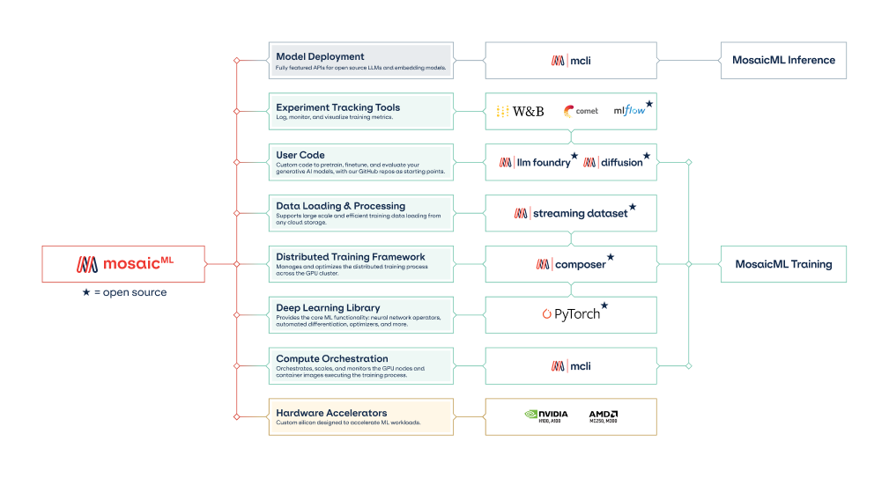

<br />
<p align="center">
    <a href="https://github.com/mosaicml/composer#gh-light-mode-only" class="only-light">
      
    </a>
    <!-- SETUPTOOLS_LONG_DESCRIPTION_HIDE_BEGIN -->
    <a href="https://github.com/mosaicml/composer#gh-dark-mode-only" class="only-dark">
      
    </a>
    <!-- SETUPTOOLS_LONG_DESCRIPTION_HIDE_END -->
</p>

<h2><p align="center">Supercharge your Model Training</p></h2>
<h3><p align="center">Deep Learning Framework for Training at Scale</p></h3>

<h4><p align='center'>
<a href="https://www.mosaicml.com">[Website]</a>
- <a href="https://docs.mosaicml.com/projects/composer/en/stable/getting_started/installation.html">[Getting Started]</a>
- <a href="https://docs.mosaicml.com/projects/composer/">[Docs]</a>
- <a href="https://www.databricks.com/company/careers/open-positions?department=Mosaic%20AI&location=all">[We're Hiring!]</a>
</p></h4>

<p align="center">
    <a href="https://pypi.org/project/mosaicml/">
        
    </a>
    <a href="https://pypi.org/project/mosaicml/">
        
    </a>
    <a href="https://pepy.tech/project/mosaicml/">
        
    </a>
    <a href="https://docs.mosaicml.com/projects/composer/en/stable/">
        
    </a>
    <a href="https://dub.sh/mcomm">
        
    </a>
    <a href="https://github.com/mosaicml/composer/blob/dev/LICENSE">
        
    </a>
</p>
<br />

# **👋 Welcome**

Composer is an open-source deep learning training library by [MosaicML](https://www.mosaicml.com/). Built on top of PyTorch, the Composer library makes it easier to implement distributed training workflows on large-scale clusters.

We built Composer to be **optimized for scalability and usability**, integrating best practices for efficient, multi-node training. By abstracting away low-level complexities like parallelism techniques, distributed data loading, and memory optimization, you can focus on training modern ML models and running experiments without slowing down.

We recommend using Composer to speedup your experimentation workflow if you’re training neural networks of any size, including:

- Large Language Models (LLMs)
- Diffusion models
- Embedding models (e.g. BERT)
- Transformer-based models
- Convolutional Neural Networks (CNNs)

Composer is heavily used by the MosaicML research team to train state-of-the-art models like MPT, and we open-sourced this library to enable the ML community to do the same. This framework is used by organizations in both the tech industry and the academic sphere and is continually updated with new features, bug fixes, and stability improvements for production workloads.

# **🔑 Key Features**


We designed Composer from the ground up for modern deep learning workloads. Gone are the days of AlexNet and ResNet, when state-of-the-art models could be trained on a couple of desktop GPUs. Today, developing the latest and greatest deep learning models often requires cluster-scale hardware — but with Composer’s help, you’ll hardly notice the difference.

The heart of Composer is our Trainer abstraction: a highly optimized PyTorch training loop designed to allow both you and your model to iterate faster. Our trainer has simple ways for you to configure your parallelization scheme, data loaders, metrics, loggers, and more.

## Scalability

Whether you’re training on 1 GPU or 512 GPUs, 50MB or 10TB of data - Composer is built to keep your workflow simple.

- [**FSDP**](https://docs.mosaicml.com/projects/composer/en/stable/notes/distributed_training.html#fullyshardeddataparallel-fsdp): For large models that are too large to fit on GPUs, Composer has integrated PyTorch [FullyShardedDataParallelism](https://docs.mosaicml.com/projects/composer/en/stable/notes/distributed_training.html#fullyshardeddataparallel-fsdp) into our trainer and made it simple to efficiently parallelize custom models. We’ve found FSDP is competitive performance-wise with much more complex parallelism strategies. Alternatively, Composer also supports standard PyTorch distributed data parallelism (DDP) execution.
- [**Elastic sharded checkpointing**](https://docs.mosaicml.com/projects/composer/en/stable/notes/distributed_training.html#saving-and-loading-sharded-checkpoints-with-fsdp): Save on eight GPUs, resume on sixteen. Composer supports elastic sharded checkpointing, so you never have to worry if your sharded saved state is compatible with your new hardware setup.
- **Data streaming:** Working with large datasets? Download datasets from cloud blob storage on the fly by integrating with MosaicML [StreamingDataset](https://github.com/mosaicml/streaming) during model training.

## Customizability

Other high-level deep learning trainers provide simplicity at the cost of rigidity. When you want to add your own features, their abstractions get in your way. Composer, on the other hand, provides simple ways for you to customize our Trainer to your needs.



***Fig. 1:** Composer’s training loop has a series of events that occur at each stage in the training process. Callbacks are functions that users write to run at specific events. For example, our [Learning Rate Monitor Callback](https://docs.mosaicml.com/projects/composer/en/stable/api_reference/generated/composer.callbacks.LRMonitor.html#composer.callbacks.LRMonitor) logs the learning rate at every BATCH_END event.*

- [**Callbacks**](https://docs.mosaicml.com/projects/composer/en/stable/trainer/callbacks.html): Composer’s callback system allows you to insert custom logic at any point in the training loop. We’ve written callbacks to monitor memory usage, log and visualize images, and estimate your model’s remaining training time, to name a few. This feature is popular among researchers who want to implement and experiment with custom training techniques.
- [**Speedup algorithms**](https://docs.mosaicml.com/projects/composer/en/stable/examples/custom_speedup_methods.html): We draw from the latest research to create a collection of algorithmic speedups. Stack these speedups into MosaicML recipes to boost your training speeds. Our team has open-sourced the optimal combinations of speedups for different types of models.
    - **8x speedup: Stable Diffusion**
        - $200k original SD2 cost —> $50k ([Blog](https://www.mosaicml.com/blog/diffusion))
    - **7x speedup: ResNet-50 on ImageNet**
        - 3h33m —> 25m on 8xA100 ([Blog](https://www.mosaicml.com/blog/mosaic-resnet))
    - **8.8x speedup: BERT-Base Pretraining**
        - 10h —> 1.13h on 8xA100 ([Blog](https://www.mosaicml.com/blog/mosaicbert))
    - **5.4x speedup: DeepLab v3 on ADE20K**
        - 3h30m —> 39m on 8xA100 ([Blog](https://www.mosaicml.com/blog/behind-the-scenes))

## Better workflows

Composer is built to automate away low-level pain points and headaches so you can focus on the important (and fun) parts of deep learning and iterate faster.

- [**Auto-resumption**](https://docs.mosaicml.com/projects/composer/en/stable/notes/resumption.html): Failed training run? Have no fear — just re-run your code, and Composer will automatically resume from your latest saved checkpoint.
- [**CUDA OOM Prevention**](https://docs.mosaicml.com/projects/composer/en/stable/examples/auto_microbatching.html): Say goodbye to out-of-memory errors. Set your microbatch size to “auto”, and Composer will automatically select the biggest one that fits on your GPUs.
- **[Time Abstractions](https://docs.mosaicml.com/projects/composer/en/latest/trainer/time.html):** Ever messed up your conversion between update steps, epochs, samples, and tokens? Specify your training duration with custom units (epochs, batches, samples, and tokens) in your training loop with our `Time` class.

## Integrations

Integrate with the tools you know and love for experiment tracking and data streaming.

- **Cloud integrations**: Our Checkpointing and logging features have first-class support for remote storage and loading from Cloud bucket (OCI, GCP, AWS S3).
- **********Experiment tracking:********** Weights and Biases, MLFlow, CometML, and neptune.ai — the choice is yours, easily log your data to your favorite platform.

# **🚀 Getting Started**

## **📍**Prerequisites

Composer is designed for users who are comfortable with Python and have basic familiarity with deep learning fundamentals and PyTorch.

**********************************************Software requirements:**********************************************  A recent version of PyTorch.

**********************************************Hardware requirements:**********************************************  System with CUDA-compatible GPUs (AMD + RoCM coming soon!). Composer can run on CPUs, but for full benefits, we recommend using it on hardware accelerators.

## **💾 Installation**

Composer can be installed with `pip`:

<!--pytest.mark.skip-->
```bash
pip install mosaicml
```

To simplify the environment setup for Composer, we also provide a set of [pre-built Docker images](https://docs.mosaicml.com/projects/composer/en/stable/getting_started/installation.html#docker). We *highly recommend* you use our Docker images.

## **🏁 Quick Start**

Here is a code snippet demonstrating our Trainer on the MNIST dataset.

<!--pytest.mark.filterwarnings(r'ignore:Some targets have less than 1 total probability:UserWarning')-->
<!--pytest.mark.filterwarnings('ignore:Cannot split tensor of length .* into batches of size 128.*:UserWarning')-->
```python
import torch
import torch.nn as nn
import torch.nn.functional as F
from torchvision import datasets, transforms
from torch.utils.data import DataLoader

from composer import Trainer
from composer.models import ComposerClassifier
from composer.algorithms import LabelSmoothing, CutMix, ChannelsLast

class Model(nn.Module):
    """Toy convolutional neural network architecture in pytorch for MNIST."""

    def __init__(self, num_classes: int = 10):
        super().__init__()

        self.num_classes = num_classes

        self.conv1 = nn.Conv2d(1, 16, (3, 3), padding=0)
        self.conv2 = nn.Conv2d(16, 32, (3, 3), padding=0)
        self.bn = nn.BatchNorm2d(32)
        self.fc1 = nn.Linear(32 * 16, 32)
        self.fc2 = nn.Linear(32, num_classes)

    def forward(self, x):
        out = self.conv1(x)
        out = F.relu(out)
        out = self.conv2(out)
        out = self.bn(out)
        out = F.relu(out)
        out = F.adaptive_avg_pool2d(out, (4, 4))
        out = torch.flatten(out, 1, -1)
        out = self.fc1(out)
        out = F.relu(out)
        return self.fc2(out)

transform = transforms.Compose([transforms.ToTensor()])
dataset = datasets.MNIST("data", train=True, download=True, transform=transform)
train_dataloader = DataLoader(dataset, batch_size=128)

trainer = Trainer(
    model=ComposerClassifier(module=Model(), num_classes=10),
    train_dataloader=train_dataloader,
    max_duration="2ep",
    algorithms=[
        LabelSmoothing(smoothing=0.1),
        CutMix(alpha=1.0),
        ChannelsLast(),
    ],
)
trainer.fit()
```

Next, check out our [Getting Started Colab](https://colab.research.google.com/github/mosaicml/composer/blob/9f594876f957c912758e540598ac9f47a468c39d/examples/getting_started.ipynb) for a walk-through of Composer’s main features. In this tutorial, we will cover the basics of the Composer Trainer:

- Dataloader
- Trainer
- Optimizer and Scheduler
- Logging
- Training a baseline model
- Speeding up training

## **📚 Learn more**

Once you’ve completed the Quick Start, you can go through the below tutorials or our [documentation](https://docs.mosaicml.com/projects/composer/en/stable/) to further familiarize yourself with Composer.

If you have any questions, please feel free to reach out to us on our [Community Slack](https://dub.sh/mcomm)!

Here are some resources actively maintained by the Composer community to help you get started:
<table>
<thead>
  <tr>
      <th><b>Resource</b></th>
      <th><b>Details</b></th>
  </tr>
</thead>
<tbody>
    <tr>
    <td><a href="https://colab.research.google.com/github/mosaicml/composer/blob/dev/examples/finetune_huggingface.ipynb" target="_blank" rel="noopener noreferrer">Training BERTs with Composer and 🤗 </a></td>
    <td>A Colab Notebook showing how to train BERT models with Composer and 🤗!</td>
  </tr>
  <tr>
    <td><a href="https://github.com/mosaicml/llm-foundry/blob/main/TUTORIAL.md" target="_blank" rel="noopener noreferrer">Pretraining and Finetuning an LLM Tutorial</a></td>
    <td>A tutorial from MosaicML’s LLM Foundry, using MosaicML Composer, StreamingDataset, and MCLI on training and evaluating LLMs.</td>
  </tr>
  <tr>
    <td><a href="https://docs.mosaicml.com/projects/composer/en/stable/examples/migrate_from_ptl.html" target="_blank" rel="noopener noreferrer">Migrating from PyTorch Lightning</a></td>
    <td>A tutorial is to illustrating a path from working in PyTorch Lightning to working in Composer.</td>
  </tr>
  <tr>
    <td><a href="https://docs.mosaicml.com/projects/composer/en/stable/examples/finetune_huggingface.html" target="_blank" rel="noopener noreferrer">Finetuning and Pretraining HuggingFace Models</a></td>
    <td>Want to use Hugging Face models with Composer? No problem. Here, we’ll walk through using Composer to fine-tune a pretrained Hugging Face BERT model.</td>
  </tr>
  <tr>
    <td><a href="https://colab.research.google.com/github/mosaicml/composer/blob/dev/examples/custom_speedup_methods.ipynb" target="_blank" rel="noopener noreferrer">Building Speedup Methods</a></td>
    <td>A Colab Notebook showing how to build new training modifications on top of Composer</td>
  </tr>

</tbody>
</table>

# 🛠️ For Best Results, Use within the Databricks & MosaicML Ecosystem

Composer can be used on its own, but for the smoothest experience we recommend using it in combination with other components of the MosaicML ecosystem:



- [**Mosaic AI training**](https://www.databricks.com/product/machine-learning/mosaic-ai-training) (MCLI)- Our proprietary Command Line Interface (CLI) and Python SDK for orchestrating, scaling, and monitoring the GPU nodes and container images executing training and deployment. Used by our customers for training their own Generative AI models.
    - **To get started, [reach out here](https://www.databricks.com/company/contact) and check out our [Training](https://www.databricks.com/product/machine-learning/mosaic-ai-training) product pages**
- [**MosaicML LLM Foundry**](https://github.com/mosaicml/llm-foundry) - This open source repository contains code for training, finetuning, evaluating, and preparing LLMs for inference with [Composer](https://github.com/mosaicml/composer). Designed to be easy to use, efficient and flexible, this codebase is designed to enable rapid experimentation with the latest techniques.
- [**MosaicML StreamingDataset**](https://github.com/mosaicml/streaming) - Open-source library for fast, accurate streaming from cloud storage.
- [**MosaicML Diffusion**](https://github.com/mosaicml/diffusion) - Open-source code to train your own Stable Diffusion model on your own data.  Learn more via our blogs: ([Results](https://www.mosaicml.com/blog/stable-diffusion-2) , [Speedup Details](https://www.mosaicml.com/blog/diffusion))

# **🏆 Project Showcase**

Here are some projects and experiments that used Composer. Got something to add? Share in our [Community Slack](https://dub.sh/mcomm)!

- [**MPT Foundation Series:**](https://www.mosaicml.com/mpt) Commercially usable open source LLMs, optimized for fast training and inference and trained with Composer.
    - [MPT-7B Blog](https://www.mosaicml.com/blog/mpt-7b)
    - [MPT-7B-8k Blog](https://www.mosaicml.com/blog/long-context-mpt-7b-8k)
    - [MPT-30B Blog](https://www.mosaicml.com/blog/mpt-30b)
- [**Mosaic Diffusion Models**](https://www.mosaicml.com/blog/training-stable-diffusion-from-scratch-costs-160k): see how we trained a stable diffusion model from scratch for <$50k
- [**replit-code-v1-3b**](https://huggingface.co/replit/replit-code-v1-3b): A 2.7B Causal Language Model focused on **Code Completion,** trained by Replit on Mosaic AI training in 10 days.
- **BabyLLM:** the first LLM to support both Arabic and English. This 7B model was trained by MetaDialog on the world’s largest Arabic/English dataset to improve customer support workflows ([Blog](https://blogs.nvidia.com/blog/2023/08/31/generative-ai-startups-africa-middle-east/))
- [**BioMedLM**](https://www.mosaicml.com/blog/introducing-pubmed-gpt): a domain-specific LLM for Bio Medicine built by MosaicML and [Stanford CRFM](https://crfm.stanford.edu/)

# 💫 Contributors

Composer is part of the broader Machine Learning community, and we welcome any contributions, pull requests, or issues!

To start contributing, see our [Contributing](https://github.com/mosaicml/composer/blob/dev/CONTRIBUTING.md) page.

P.S.: [We're hiring](https://www.databricks.com/company/careers/open-positions?department=Mosaic%20AI&location=all)!

# ❓FAQ

- **What is the best tech stack you recommend when training large models?**
    - We recommend that users combine components of the MosaicML ecosystem for the smoothest experience:
        - Composer
        - [StreamingDataset](https://github.com/mosaicml/streaming)
        - [MCLI](https://www.databricks.com/product/machine-learning/mosaic-ai-training) (Databricks Mosaic AI Training)
- **How can I get community support for using Composer?**
    - You can join our [Community Slack](https://dub.sh/mcomm)!
- **How does Composer compare to other trainers like NeMo Megatron and PyTorch Lightning?**
    - We built Composer to be optimized for both simplicity and efficiency. Community users have shared that they enjoy Composer for its capabilities and ease of use compared to alternative libraries.
- **How do I use Composer to train graph neural networks (GNNs), or Generative Adversarial Networks (GANs), or models for reinforcement learning (RL)?**
    - We recommend you use alternative libraries for if you want to train these types of models - a lot of assumptions we made when designing Composer are suboptimal for GNNs, RL, and GANs
- **How can I speed up HuggingFace downloads?
    - You can use hf transfer (`pip install hf-transfer`) and set the environment variable `HF_HUB_ENABLE_HF_TRANSFER=1`

# ✍️ Citation
```
@misc{mosaicml2022composer,
    author = {The Mosaic ML Team},
    title = {composer},
    year = {2021},
    howpublished = {\url{https://github.com/mosaicml/composer/}},
}
```
