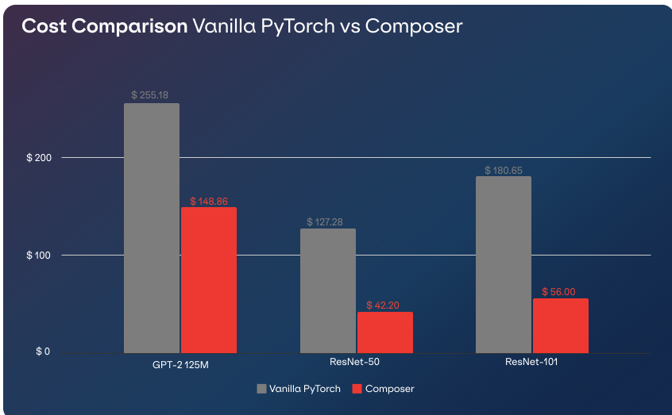

<p align="center">
    
    
</p>

<h3><p align="center"><b>Reproducible State-Of-The-Art Training Efficiency:</b><br />Giving You Lower Cost and Better Accuracy</p></h3>
<!--<center><h3><b>Bring state-of-the-art efficiency research to you</h3></center>-->

<p align='center'>
<a href="https://google.com">[Website]</a>
- <a href="https://google.com">[Getting Started]</a>
- <a href="https://google.com">[Examples]</a>
- <a href="https://google.com">[Docs]</a>
- <a href="https://google.com">[Methods]</a>
- <a href="https://google.com">[Explorer]</a>
- <a href="https://google.com">[We're Hiring!]</a>
</p>

<p align="center">
    <a href="https://pypi.org/project/mosaicml/">
        
    </a>
    <a href="https://badge.fury.io/py/mosaicml">
        
    </a>
    <a href="https://pepy.tech/project/mosaicml">
        
    </a>
    <a href="https://docs.mosaicml.com/en/stable/">
        
    </a>
    <a href="https://join.slack.com/t/mosaicml-community/shared_invite/zt-w0tiddn9-WGTlRpfjcO9J5jyrMub1dg">
        
    </a>
    <a href="https://join.slack.com/t/mosaicml-community/shared_invite/zt-w0tiddn9-WGTlRpfjcO9J5jyrMub1dg">
        
    </a>
</p>

<hr />

<p align="center">Composer provides well-engineered implementations of efficient training methods to give the tools that help you train <b>a better model for cheaper</b>.</p>

<p align="center"></p>

Using Composer, you can:

- Train an ImageNet model to 76.1% accuracy for $37 (_with vanilla PyTorch:_ $127)
- Train a GPT-2 125M to a perplexity of 23.9 for $148 (_with vanilla PyTorch_: $255)
- Use start-of-the-art implementations of methods to speed up your own training loop.

At MosaicML, we are focused on making training ML models accessible. To do this, we continually productionize state-of-the-art academic research on efficient model training, and also study the _combinations_ of these methods in order to ensure that model training is ✨ as efficient as possible ✨.

Everyone has their own priorities: best accuracy, cheapest cost, and somewhere in between.  Composer provides novel recipes that push the boundary of both cost and accuracy. Composer allows you to choose **the best model for your real-world constraints**.

Composer features:
- 20+ efficient training methods for training a better language and vision models! Don't waste hours trying to reproduce research papers when Composer has done the work for you.
- Easy-to-use (optional) Trainer interface written to be as performant as possible, and [integrated best practices](https://www.mosaicml.com/blog/best-practices-dec-2021).
- Easy-to-use Functional forms that allow you to integrate efficient training methods into your training loop!
- Strong, _reproducible_ baselines to get you started as 💨 fast 💨 as possible

## Quickstart

### Installation
Composer is available with Pip

```bash
pip install mosaicml
```
Alternatively install Composer with Conda
```bash
conda install mosaicml
```
---

### Usage

Composer provides both a **Functional API** (similar to `torch.nn.functional`) and a **Trainer** (that abstracts away the training loop) to provide flexibility to users.

#### Example: Functional API [](https://colab.research.google.com/drive/1HIxLs61pyf0ln7MlnrGYvkNHq1uVbNWu?usp=sharing)

For users who choose to use their own training loop, we provide state-less functional implementations of our algorithms for a end-user to integrate.

The following example highlights using [BlurPool](https://arxiv.org/abs/1904.11486), which applies an anti-aliasing filter before every downsampling operation.

```python
from composer import functional as cf
import torchvision

model = torchvision.models.resnet50()

# Apply model surgery before training by replacing eligible layers
# with a BlurPool-enabled layer (Zhang, 2019)
model = cf.apply_blurpool(model)

# Start your training loop here
for epoch in range(NUM_EPOCHS):
    for input, labels in dataloader:
        optimizer.zero_grad()
        outputs = net(inputs)
        loss = criterion(outputs, labels)
        loss.backward()
        optimizer.step()
```

See the official [Composer Functional API Colab notebook](https://colab.research.google.com/drive/1HIxLs61pyf0ln7MlnrGYvkNHq1uVbNWu?usp=sharing) for more.

#### Example: Trainer [](https://drive.google.com/file/d/12Dl0NVDaj4tf4gfpfg-rkIAoO_H7edo3/edit)

For maximal speedups, we recommend using our Trainer, which manages handling user state, performant algorithm implementations, and provides useful engineering abstractions to permit rapid experimentation.

```python

import composer

# Normalization constants
mean = (0.507, 0.487, 0.441)
std = (0.267, 0.256, 0.276)

batch_size = 1024

# setup data
data_directory = "data"
cifar10_transforms = transforms.Compose([transforms.ToTensor(), transforms.Normalize(mean, std)]
train_dataset = datasets.CIFAR10(data_directory, train=True, download=True, transform=cifar10_transforms)
test_dataset = datasets.CIFAR10(data_directory, train=False, download=True, transform=cifar10_transforms)

# setup model & optimization
model = composer.models.CIFAR10_ResNet56()

optimizer = composer.optim.DecoupledSGDW(
    model.parameters(), # Model parameters to update
    lr=0.05, # Peak learning rate
    momentum=0.9,
    weight_decay=2.0e-3 # If this looks large, it's because its not scaled by the LR as in non-decoupled weight decay
)

warmup = composer.optim.WarmUpLR(
    optimizer, # Optimizer
    warmup_iters=25, # Number of iterations to warmup over. 50k samples * 1 batch/2048 samples
    warmup_method="linear", # Linear warmup
    warmup_factor=1e-4, # Initial LR = LR * warmup_factor
    interval="step", # Update LR with stepwise granularity for superior results
)

# setup algorithm in one line
blurpool = composer.algorithms.BlurPool()  # credit:  (Zhang, 2019)

# for brevity, we hardcode some argument values
trainer = composer.trainer.Trainer(model=model,
                                   train_dataloader=train_dataloader,
                                   eval_dataloader=test_dataloader,
                                   max_duration="3ep", # Train for 3 epochs because we're assuming Colab environment and hardware
                                   optimizers=optimizer,
                                   schedulers=[warmup],
                                   algorithms=[blurpool] # Adding BlurPool via model surgery, can just add more algorithms here!
                                   device="gpu" # Train on the GPU,
                                   seed=42) # the meaning to life, the universe, and everything

# start training!
trainer.fit()
```
Using the Composer Trainer allows you to **add multiple efficient training methods in a single line of code!**  Trying out new methods or combinations of methods is as easy as adding another line! As Composer gets better and we implement more methods and quality of life improvements, the savings are directly passed to you.

For concrete examples of methods in Composer, here's some (_see [here](https://docs.mosaicml.com) for all_) efficiency methods currently in Composer:

Name|Functional|Attribution|tl;dr
----|----------|-----------|-----
[Alibi](https://github.com/mosaicml/composer/tree/dev/composer/algorithms/alibi)|`cf.apply_alibi`|[(Press et al, 2021)](https://arxiv.org/abs/2108.12409v1)|Replace attention with AliBi
[AugMix](https://github.com/mosaicml/composer/tree/dev/composer/algorithms/augmix)|`cf.augmix_image`|[(Hendrycks et al, 2020)](http://arxiv.org/abs/1912.02781)|Image-perserving data augmentations
[BlurPool](https://github.com/mosaicml/composer/tree/dev/composer/algorithms/blurpool)|`cf.apply_blurpool`|[(Zhang, 2019)](https://arxiv.org/abs/1904.11486)|applies blur before pooling
[ChannelsLast](https://github.com/mosaicml/composer/tree/dev/composer/algorithms/channels_last)|`cf.apply_channels_last`|[PyTorch](https://pytorch.org/tutorials/intermediate/memory_format_tutorial.html)|Uses channels last memory format (NHWC)
[ColOut](https://github.com/mosaicml/composer/tree/dev/composer/algorithms/colout)|`cf.colout_batch`|[Many](https://www.mosaicml.com)|Removes columns and rows from the image for augmentation and efficiency.
[CutMix](https://github.com/mosaicml/composer/tree/dev/composer/algorithms/cutmix)|`cf.cutmix_batch`|[(Yun et al, 2019)](https://arxiv.org/abs/1905.04899)|Combines pairs of examples in non-overlapping regions and mixes labels
[CutOut](https://github.com/mosaicml/composer/tree/dev/composer/algorithms/cutout)|`cf.cutout_batch`|[(DeVries et al, 2017)](https://arxiv.org/abs/1708.04552)|Randomly erases rectangular blocks from the image.
[Factorize](https://github.com/mosaicml/composer/tree/dev/composer/algorithms/factorize)|`cf.apply_factorization`|[MosaicML](https://www.mosaicml.com)|Factorize GEMMs into smaller GEMMs
[GhostBatchNorm](https://github.com/mosaicml/composer/tree/dev/composer/algorithms/ghost_batchnorm)|`cf.apply_ghost_batchnorm`|[(Dimitriou et al, 2020)](https://arxiv.org/abs/2007.08554)|Use smaller samples to compute batchnorm
[LabelSmoothing](https://github.com/mosaicml/composer/tree/dev/composer/algorithms/label_smoothing)|`cf.smooth_labels`|[(Szegedy et al, 2015)](https://arxiv.org/abs/1512.00567)|Smooths the labels with a uniform prior
[LayerFreezing](https://github.com/mosaicml/composer/tree/dev/composer/algorithms/layer_freezing)|`cf.freeze_layers`|[Many (Raghu et al, 2017)](https://arxiv.org/abs/1706.05806)|Progressively freezes layers during training.
[MixUp](https://github.com/mosaicml/composer/tree/dev/composer/algorithms/mixup)|`cf.mixup_batch`|[(Zhang et al, 2017)](https://arxiv.org/abs/1710.09412)|Blends pairs of examples and labels
[ProgressiveResizing](https://github.com/mosaicml/composer/tree/dev/composer/algorithms/progressive_resizing)|`cf.resize_batch`|[Fast AI](https://github.com/fastai/fastbook/blob/780b76bef3127ce5b64f8230fce60e915a7e0735/07_sizing_and_tta.ipynb)|Increases the input image size during training
[RandAugment](https://github.com/mosaicml/composer/tree/dev/composer/algorithms/randaugment)|`cf.randaugment_image`|[(Cubuk et al, 2020)](https://openaccess.thecvf.com/content_CVPRW_2020/html/w40/Cubuk_Randaugment_Practical_Automated_Data_Augmentation_With_a_Reduced_Search_Space_CVPRW_2020_paper.html)|Applies a series of random augmentations
[SAM](https://github.com/mosaicml/composer/tree/dev/composer/algorithms/sam)|`N/A`|[(Foret et al, 2021)](https://arxiv.org/abs/2010.01412)|SAM optimizer measures sharpness of optimization space
[ScaleSchedule](https://github.com/mosaicml/composer/tree/dev/composer/algorithms/scale_schedule)|`N/A`|[Many](https://www.mosaicml.com)|Scale the learning rate schedule by a factor
[SelectiveBackprop](https://github.com/mosaicml/composer/tree/dev/composer/algorithms/selective_backprop)|`cf.selective_backprop`|[(Jiang et al, 2019)](https://arxiv.org/abs/1910.00762)|Drops examples with small loss contributions.
[SeqLengthWarmup](https://github.com/mosaicml/composer/tree/dev/composer/algorithms/seq_length_warmup)|`cf.set_batch_sequence_length`|[(Li et al, 2021)](https://arxiv.org/abs/2108.06084)|Progressively increase sequence length.
[SqueezeExcite](https://github.com/mosaicml/composer/tree/dev/composer/algorithms/squeeze_excite)|`cf.apply_squeeze_excite`|[Hu et al, 2017](https://arxiv.org/abs/1709.01507)|Replaces eligible layers with Squeeze-Excite layers
[StochasticDepth](https://github.com/mosaicml/composer/tree/dev/composer/algorithms/stochastic_depth)|`cf.apply_stochastic_depth`|[(Huang et al, 2016)](https://arxiv.org/abs/1603.09382)|Replaces a specified layer with a stochastic verion that randomly drops the layer or samples during training
[SWA](https://github.com/mosaicml/composer/tree/dev/composer/algorithms/swa)|`N/A`|[(Izmailov et al, 2018)](https://arxiv.org/abs/1803.05407)|Computes running average of model weights.


Speedups are measured based on time to train to iso-accuracy.

## What benchmarks does Composer support?

MosaicML uses a _benchmark_ as a term to denote an reproducible standard within the machine learning community. A benchmark is a specific model trained for a task, where a task is defined as a specific dataset with a specific loss function.

Composer is currently focused on supporting computer vision and natural language processing use cases. We currently support the following combinations of models, datasets, and loss functions.

<div class="center">
<table>
<thead>
  <tr>
    <th>Model</th>
    <th>Dataset</th>
    <th>Loss</th>
    <th>Task</th>
    <th>Evaluation Metrics</th>
  </tr>
</thead>
<tbody>
  <tr>
      <td colspan="5" align="center"><b>Computer Vision</b></td>
  </tr>
  <tr>
    <td>ResNet Family</td>
    <td>CIFAR-10</td>
    <td>Cross Entropy</td>
    <td>Image Classification</td>
    <td>Classification Accuracy</td>
  </tr>
  <tr>
    <td>ResNet Family</td>
    <td>ImageNet</td>
    <td>Cross Entropy</td>
    <td>Image Classification</td>
    <td>Classification Accuracy</td>
  </tr>
  <tr>
    <td>EfficientNet Family</td>
    <td>ImageNet</td>
    <td>Cross Entropy</td>
    <td>Image Classification</td>
    <td>Classification Accuracy</td>
  </tr>
  <tr>
    <td>UNet</td>
    <td>BraTS</td>
    <td>Dice Loss</td>
    <td>Image Segmentation</td>
    <td>Dice Coefficient</td>
  </tr>
  <tr>
    <td>DeepLab v3</td>
    <td>ADE20K</td>
    <td>Cross Entropy</td>
    <td>Image Segmentation</td>
    <td>mIoU</td>
  </tr>
  <tr>
      <td align="center" colspan="5"><b>Natural Language Processing</b></td>
  </tr>
  <tr>
    <td>BERT Family</td>
    <td>{OpenWebText, C4}</td>
    <td>Cross Entropy</td>
    <td>Masked Language Modeling</td>
    <td>GLUE </td>
  </tr>
  <tr>
    <td>GPT Family</td>
    <td>{Wikipedia &amp; BooksCorpus, C4}</td>
    <td>Cross Entropy</td>
    <td>Language Modeling<br></td>
    <td>Perplexity</td>
  </tr>
</tbody>
</table>
</div>

## Why use Composer?
The compute required to train a state-of-the-art machine learning model is [doubling every 6 months](https://arxiv.org/abs/2202.05924), subsequently making machine learning less accessible for the broader community. Composer shifts the focus to _efficiency_, and contains reproducible versions of cutting-edge algorithms that help reduce the compute and cost required to train state-of-the-art models. While every paper will claim state-of-the-art efficiency results, Composer will be your source well-engineered implementations of **efficient training methods that actually work in practice**.

Furthermore, combining these efficiency methods together isn't a piece of cake. When exploring how to seamlessly combine different efficient training methods, we that existing Trainers failed to provide a flexible design that would be needed to interleave and inject many different methods into the training loop.  To fulfill this need, we designed a Trainer built for efficiency from first-principles.  In Composer, we carefully designed new abstractions to allow us to have flexibility in all necesssary parts of the training loop.

Composer is designed with **two-way callbacks** ([Howard et al, 2020](https://arxiv.org/abs/2002.04688)) as a first-class citizen. This enables easy injection of efficiency methods throughout the entire training loop.  Not only does the two-way callback system trigger at every part of the training loop, each callback is designed to pass the **entire training state** designed so that any part of training can be modified.

Composer leverages the two-way callback system to seamlessly integrate our methods into the training pipeline, for examples:
 - Composer modifies data inputs for batches (data augmentations, sequence length warmup, skipping examples, etc)
 - Composer modifies the neural network (layer freezing, pruning, model surgery, etc)
 - Composer modifies the loss function (label smoothing, MixUp, CutMix, etc)
 - Composer modifies the optimizer (Sharpness Aware Minimization)

With Composer, we make it easy to add your own methods or callbacks to easily instrument any part of the training loop.

## Why shouldn’t I use Composer?

Composer is a framework built with a focus on training the most _efficient_ model for your downstream task.

* If training efficiency is not a concern, then Composer may not be as well suited for your task. Inference efficiency is not in the current roadmap for Composer support.
* Composer currently supports most computer vision (CV) and natural language processing (NLP) use cases. We will support most industry applications, but may not support highly custom or novel architectures.

Composer is an active and ongoing project. Since Composer is still in alpha, our API may not be stable. We recommend pegging your work to a Composer version.

We welcome any comments, feedback, or contributions to Composer! Please do not hesitate to file an issue or pull request 🤩.

## Learn More

Here's some resources actively maintained by the Composer community to help you get started:
<table>
<thead>
  <tr>
      <th><b>Resource</b></th>
      <th><b>Details</b></th>
  </tr>
</thead>
<tbody>
  <tr>
    <td><a href="https://www.mosaicml.com/blog/founders-blog" target="_blank" rel="noopener noreferrer">Founder's Blog</a></td>
    <td>A blog post by our founders highlighting why MosaicML exists</td>
  </tr>
  <tr>
    <td><a href="https://drive.google.com/file/d/12Dl0NVDaj4tf4gfpfg-rkIAoO_H7edo3/edit" target="_blank" rel="noopener noreferrer">Getting started with our Trainer</a></td>
    <td>An interactive Colab Notebook aimed at teaching users about our Trainer</td>
  </tr>
  <tr>
    <td><a href="https://colab.research.google.com/drive/1HIxLs61pyf0ln7MlnrGYvkNHq1uVbNWu?usp=sharing" target="_blank" rel="noopener noreferrer">Getting started with our Functional API</a></td>
    <td>An interactive Colab Notebook aimed at teaching users about our Functional API</td>
  </tr>
  <tr>
    <td><a href="https://colab.research.google.com/" target="_blank" rel="noopener noreferrer">PyTorch Lightning Migration Guide</a></td>
    <td>An interactive Colab Notebook aimed at helping users migrate from PTL to Composer</td>
  </tr>
  <tr>
    <td><a href="https://mosaicml.com/jobs" target="_blank" rel="noopener noreferrer">We're Hiring!</a></td>
    <td>Join us! 🤩</td>
  </tr>
</tbody>
</table>

If you have any questions, please feel free to reach out to us on [Twiter](https://twitter.com/mosaicml), [email](mailto:community@mosaicml.com), or our [Community Slack](https://join.slack.com/t/mosaicml-community/shared_invite/zt-w0tiddn9-WGTlRpfjcO9J5jyrMub1dg)!

## Contributors
Composer is part of the broader Machine Learning community, and we welcome any contributions, pull requests, or issues!

## Citation
```
@misc{mosaicml2022composer,
    author = {The Mosaic ML Team},
    title = {composer},
    year = {2021},
    howpublished = {\url{https://github.com/mosaicml/composer/}},
}
```
