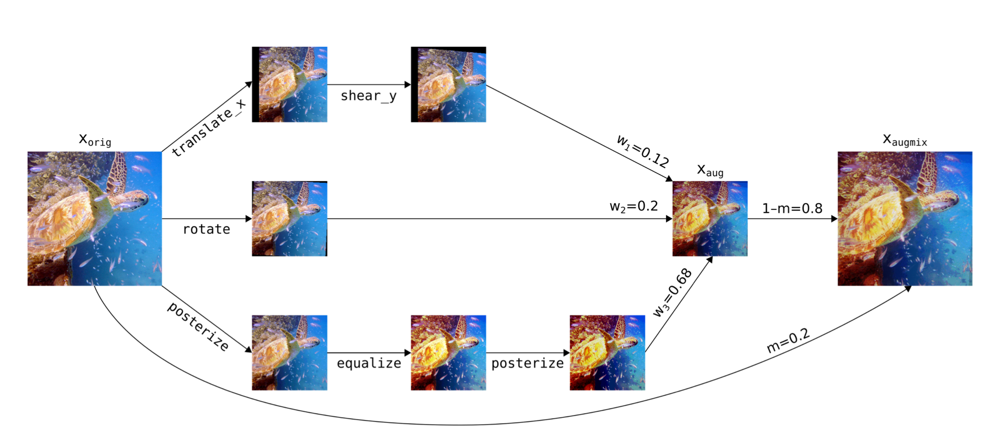

# AugMix

[\[How to Use\]](#how-to-use) - [\[Suggested Hyperparameters\]](#suggested-hyperparameters) - [\[Technical Details\]](#technical-details) - [\[Attribution\]](#attribution)

`Computer Vision`

For each data sample, AugMix creates an _augmentation chain_ by sampling `depth` image augmentations from a set (e.g. translation, shear, contrast).
It then applies these augmentations sequentially with randomly sampled intensity.
This is repeated `width` times in parallel to create `width` different augmented images.
The augmented images are then combined via a random convex combination to yield a single augmented image, which is in turn combined via a random convex combination sampled from a Beta(`alpha`, `alpha`) distribution with the original image.

|  |
|:--:
|*An image of a turtle that undergoes three different augmentation chains, gets combined back together using a convex combination, and gets combined with the original image. [Figure 4 from Hendrycks et al. (2020)](https://arxiv.org/abs/1912.02781).*|

## How to Use

### Functional Interface

TODO(MATTHEW): FIX

```python
def training_loop(model, train_loader):
  opt = torch.optim.Adam(model.parameters())
  loss_fn = F.cross_entropy
  model.train()
  
  for epoch in range(num_epochs):
      for X, y in train_loader:
          y_hat = model(X)
          loss = loss_fn(y_hat, y)
          loss.backward()
          opt.step()
          opt.zero_grad()
```

### Composer Trainer

TODO(MATTHEW): Fix and provide commentary and/or comments

```python
from composer.algorithms import Alibi
from composer.trainer import Trainer

trainer = Trainer(model=model,
                  train_dataloader=train_dataloader,
                  max_duration='1ep',
                  algorithms=[
                  ])

trainer.fit()
```

### Implementation Details

AugMix is implemented by... TODO(Matthew)

## Suggested Hyperparameters

[As per Hendrycks et al. (2020)](https://arxiv.org/abs/1912.02781), we found that `width= 3`, `depth= -1`, (`depth= -1` means that depth will be randomly sampled from the uniform distribution {1, 2, 3} for each data sample), `severity= 3` (out of a maximum possible value of 10), and `alpha= 1` (i.e., performing no mixing with the original image) worked well for different models of the ResNet family. We used `augmentation_set=all`.

> ❗ Potential CPU Bottleneck
> 
> Further increasing `width` or `depth` significantly decreases throughput due to bottlenecks in performing data augmentation.

> ❗ CIFAR-10C and ImageNet-C are no longer out-of-distribution
> 
> [CIFAR-10C and ImageNet-C](https://github.com/hendrycks/robustness) are test sets created to evaluate the ability of models to generalize to images that are corrupted in various ways (i.e., images that are _out-of-distribution_ with respect to the standard CIFAR-10 and ImageNet training sets).
> These images were corrupted using some of the augmentation techniques in `augmentation_set=all`.
> If you use `augmentation_set=all`, these images are therefore no longer out-of-distribution.

## Technical Details

AugMix randomly samples image augmentations (with replacement) from the set of {translate_x, translate_y, shear_x, shear_y, rotate, solarize, equalize, posterize, autocontrast, color, brightness, contrast, sharpness}, with the intensity of each augmentation sampled uniformly from 0.1-`severity` (`severity` ≤ 10).
The augmentations use the PILLOW Image library (specifically Pillow-SIMD); we found OpenCV-based augmentations resulted in similar or worse performance.
AugMix is applied after "standard" image transformations such as resizing and cropping, and before normalization.
Hendrycks et al.’s original implementation of AugMix also includes a custom loss function computed across three samples (an image and two AugMix’d versions of that image).
We omit this custom loss function from our AugMix implementation because it effectively triples the number of samples required for a parameter update step, imposing a significant computational burden.
Our implementation, which consists only of the augmentation component of AugMix, is referred to by Hendrycks et al. as "AugmentAndMix."

Hendrycks et al. report a 13.8% accuracy improvement on CIFAR-10C (a benchmark for corruption robustness) over baseline for a 40-2 Wide ResNet and a 1.5-10% improvement over other augmentation schemes.
Hendrycks et al. also report a 1.5% improvement over a baseline ResNet-50 on ImageNet, but this result uses AugMix in combination with the aforementioned custom loss function.
When omitting the custom loss function and using the AugMix augmentation scheme alone, we observe an accuracy gain of about 0.5% over a baseline ResNet-50 on ImageNet.
However, the increased CPU load imposed by AugMix substantially reduces throughput.

> ❗ Potential CPU Bottleneck
> 
> We found that using AugMix with the hyperparameters recommended by Hendrycks et al. can increase the data augmentation load on the CPU so much that it bottlenecks training.
> Depending on the hardware configuration and model, we found that those hyperparameters increased training time by 1.1x-10x.

AugMix will be more useful in overparameterized regimes (i.e. larger models) and for longer training runs.
Larger models typically take longer to run on a deep learning accelerator (e.g., a GPU), meaning there is more headroom to perform work on the CPU before augmentation becomes a bottleneck.
In addition, AugMix is a regularization technique, meaning it makes training more difficult.
Doing so can allow models to reach higher quality, but this typically requires (1) larger models with more capacity to perform this more difficult learning and (2) longer training runs to allow these models time to learn.

> 🚧 AugMix May Reduce Quality for Smaller Models and Shorter Training Runs
> 
> AugMix is a regularization technique that makes training more difficult for the model.
> This can lead to higher model quality for longer training runs but may decrease accuracy for shorter training runs and require a larger model to overcome this difficulty.

> 🚧 Composiing Regularization Methods
>
> As general rule, composing regularization methods may lead to diminishing returns in quality improvements while increasing the risk of creating a CPU bottleneck.

## Attribution

[*AugMix: A Simple Data Processing Method to Improve Robustness and Uncertainty*](https://arxiv.org/abs/1912.02781) by Dan Hendrycks, Norman Mu, Ekin D. Cubuk, Barret Zoph, Justin Gilmer, and Balaji Lakshminarayanan. Published in ICLR 2020.

*The Composer implementation of this method and the accompanying documentation were produced by Matthew Leavitt at MosaicML.*
