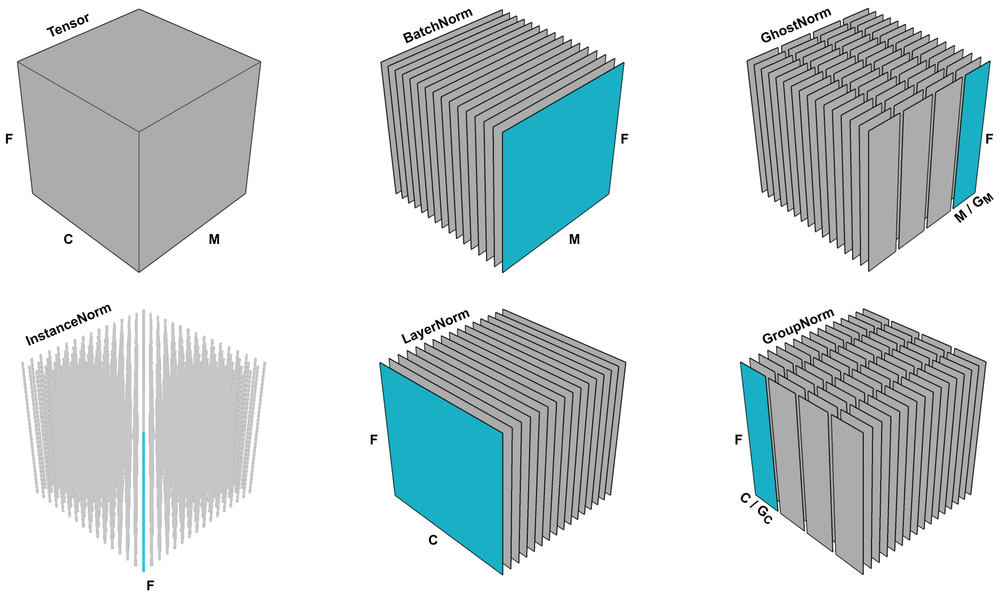

# Ghost BatchNorm

[\[How to Use\]](#how-to-use) - [\[Suggested Hyperparameters\]](#suggested-hyperparameters) - [\[Technical Details\]](#technical-details) - [\[Attribution\]](#attribution)

`Computer Vision`

During training, BatchNorm normalizes a batch of inputs to have a mean of 0 and variance of 1.
Ghost BatchNorm instead splits the batch into multiple "ghost" batches, each containing `ghost_batch_size` samples, and normalizes each one to have a mean of 0 and variance of 1.
This causes training with a large batch size to behave more similarly to training with a small batch size and acts as a regularizer.

|  |
|:--:
|*A visualization of different normalization methods on the activation map in a neural network with multiple channels. M represents the batch dimension, C represents the channel dimension, and F represents the spatial dimensions (such as height and width). Ghost BatchNorm (upper right) is a modified version of BatchNorm that normalizes the mean and variance for disjoint sub-batches of the full batch. This image is Figure 1 in [Dimitriou & Arandjelovic, 2020](https://arxiv.org/abs/2007.08554).*|

## How to Use

### Functional Interface

TODO(DAVIS): FIX

```python
def training_loop(model, train_loader):
  opt = torch.optim.Adam(model.parameters())
  loss_fn = F.cross_entropy
  model.train()
  
  for epoch in range(num_epochs):
      for X, y in train_loader:
          y_hat = model(X)
          loss = loss_fn(y_hat, y)
          loss.backward()
          opt.step()
          opt.zero_grad()
```

### Composer Trainer

TODO(DAVIS): Fix and provide commentary and/or comments

```python
from composer.algorithms import XXX
from composer.trainer import Trainer

trainer = Trainer(model=model,
                  train_dataloader=train_dataloader,
                  max_duration='1ep',
                  algorithms=[
                  ])

trainer.fit()
```

### Implementation Details

TODO(DAVIS): Explain how you did this using model surgery etc.

## Suggested Hyperparameters

On ResNets on CIFAR-10 and ImageNet, we found that batch sizes of 16, 32, and 64 consistently yield accuracy close to the baseline, and sometimes higher.

## Technical Details

Our implementation of Ghost BatchNorm works by splitting an input batch into equal-sized groups along the sample dimension and feeding each group into a normal BatchNorm module.

>❗ Running Mean and Variances Are Calculated Differently than BatchNorm
>
> This yields slightly different mean and variance statistics compared to using normal a BatchNorm module.
> The difference stems from the moving average over a sequence of groups not being equal to the true average of the groups.

For small ghost batch sizes, this method might run more slowly than normal batch normalization. This is because our implementation uses a number of operations proportional to the number of ghost batches, and each PyTorch operation has a small amount of overhead. This overhead is inconsequential when doing large chunks of “work” per operation (i.e., operating on large inputs), but can matter when the inputs are small.

>❗ Ghost BatchNorm Slows Down Training
>
> We observed throughput decreases of around 5% fewer samles per second on ResNet-50 on ImageNet.

This method may either help or harm the model’s accuracy. There is some evidence that it is more likely to help when using larger batch sizes (many thousands).
The original paper on Ghost BatchNorm reports a 0-3% accuracy change across a number of models and small-scale datasets.
Another author obtained a 13% speedup at fixed accuracy on a set of CIFAR-10 experiments.
For ResNet-50 on ImageNet, we’ve found Top-1 accuracy changes between -.3% to +.3%.

> 🚧 Ghost BatchNorm Provided Limited Benefits in Our Experiments
>
> In our experiments on ResNets for ImageNet, Ghost BatchNorm provided little or no improvements in accuracy and led to slight decreases in throughput.
> It is possible that Ghost BatchNorm may still be helpful for settings with very large batch sizes.

> 🚧 Composing Regularization Methods
>
> As general rule, composing regularization methods may lead to diminishing returns in quality improvements. Ghost BatchNorm is one such regularization method.


## Attribution

[*Train Longer, Generalize Better: Closing the Generalization Gap in Large Batch Training of Neural Networks*](https://arxiv.org/abs/1705.08741) by Elad Hoffer, Itay Hubara, and Daniel Soudry. Published in NeurIPS in 2017.

[*A New Look at Ghost Normalization*](https://arxiv.org/abs/2007.08554) by Neofyos Dimitriou and Ognjen Arandjelovic. Posted on arXiv in 2020.

*This Composer implementation of this method and the accompanying documentation were produced by Davis Blalock at MosaicML.*
