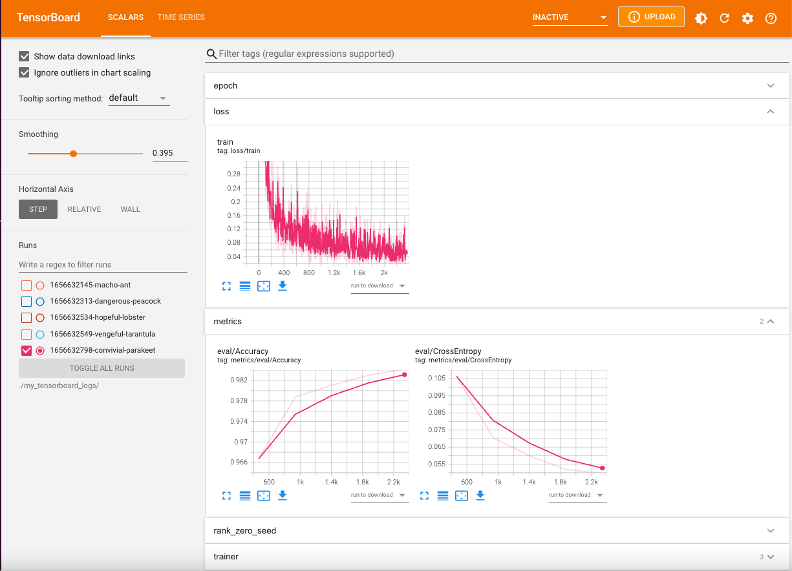

# 📋 Tensorboard Monitoring

## Installing Tensorboard
Before we get started make sure you have installed Tensorboard!
Make sure to run:

<!--pytest.mark.skip-->
```bash
pip install 'mosaicml[tensorboard]'
```

## Logging to Tensorboard Pythonically
To log your run's results to tensorboard, first you will need to create a `TensorboardLogger`
object, like so:

<!--pytest.mark.skip-->
```python
from composer.loggers import TensorboardLogger

tb_logger = TensorboardLogger(log_dir="./my_tensorboard_logs")
```

`log_dir` is where you want the Tensorboard logs to be saved locally (on the system in which you run composer).

 If you are viewing or accessing you logs locally, choose this path wisely and remember it! Also make sure to use this same value for `log_dir` for any future runs (so all your runs can be visualized together!)

 If you will be using S3 to save your logs then the exact path you choose is not as important, as your logs will automatically
 be saved to a directory called `tensorboard_logs` inside of your bucket.

 Once we have our TensorboardLogger, we just need to add it to our Trainer and then we'll be good to go. Below is an example of training MNIST with Tensorboard Logging:

<!--pytest.mark.skip-->
```python

from torchvision import datasets, transforms
from torch.utils.data import DataLoader

from composer import Trainer
from composer.models import mnist_model
from composer.loggers import TensorboardLogger

transform = transforms.Compose([transforms.ToTensor()])
train_set = datasets.MNIST("data", train=True, download=True, transform=transform)
val_set = datasets.MNIST("data", train=False, download=True, transform=transform)
train_dataloader = DataLoader(train_set, batch_size=128)
eval_dataloader = DataLoader(val_set, batch_size=64)

# Create your Tensorboard Logger here.
tb_logger = TensorboardLogger(log_dir="./my_tensorboard_logs")

trainer = Trainer(
    model=mnist_model(num_classes=10),
    train_dataloader=train_dataloader,
    eval_dataloader=eval_dataloader,
    max_duration='5ep',
    # Add your Tensorboard Logger to the trainer here.
    loggers=[tb_logger],
    eval_interval='1ep'
)
trainer.fit()
```

Now, run this code and if all goes well, your loss and metric results will be logged Tensorboard log files, which will be written to "./my_tensorboard_logs".
See [these instructions](#viewing-your-results-locally) for viewing your results in the Tensorboard viewer.

## Logging to Tensorboard using YAML configs
To log to Tensorboard using YAML config files, you can add these lines to you YAML file:
```yaml
  loggers:
    tensorboard:
      log_dir: my_tensorboard_logs
```
Putting it all together the MNIST config YAML file version of the code above should look like:

```yaml
train_dataset:
  mnist:
    is_train: true
    datadir: ./datasets/mnist
    download: true
val_dataset:
  mnist:
    is_train: false
    datadir: ./datasets/mnist
    download: true
model:
  mnist_classifier:
    num_classes: 10
max_duration: 5ep
eval_interval: 1ep
train_batch_size: 128
eval_batch_size: 64
loggers:
  tensorboard:
    log_dir: my_tensorboard_logs
```
Then save that YAML file as `mnist.yaml` for example.

To run the training using this config file, just run:

<!--pytest.mark.skip-->
```bash
python examples/run_composer_trainer.py -f mnist.yaml
```

If all goes well, your loss and metric results will be logged Tensorboard log files, which will be written to "./my_tensorboard_logs".
See [these instructions](#viewing-your-results-locally) for viewing your results in the Tensorboard viewer.

## Saving your Logs to S3
You can also save your Tensorboard logs to cloud storage such as Amazon S3. This is especially useful in cases where your run environment does not have persistent storage.

To save your logs to S3, you need to use an {class}`~.ObjectStoreLogger`

If you are using YAML configs you can get S3 logging by adding the following lines to your YAML file under loggers:

```yaml
loggers:
  object_store:
    object_store_hparams:
      s3:
        bucket: my-s3-bucket-name
```
Remember to replace `my-s3-bucket-name` with the name of your bucket.

Putting this all together, your YAML file will look like:

```yaml
train_dataset:
  mnist:
    is_train: true
    datadir: ./datasets/mnist
    download: true
val_dataset:
  mnist:
    is_train: false
    datadir: ./datasets/mnist
    download: true
model:
  mnist_classifier:
    num_classes: 10
max_duration: 5ep
eval_interval: 1ep
train_batch_size: 128
eval_batch_size: 64
loggers:
  tensorboard:
    log_dir: my_tensorboard_logs
  object_store:
    object_store_hparams:
      s3:
        bucket: my-s3-bucket-name
```

Once again you can run this job like so:

<!--pytest.mark.skip-->
```bash
python examples/run_composer_trainer.py -f mnist.yaml
```

If all goes well: your loss and metric results will be logged Tensorboard log files, which will be written to `s3://my-s3-bucket-name/tensorboard_logs`
The tensorboard logger will always name the directory inside your bucket "`tensorboard_logs`".

See [these instructions](#viewing-your-results-from-s3) for viewing your results in the Tensorboard viewer.


## Viewing your Results Locally
If you saved your Tensorboard log files locally you can view them by starting a Tensorboard process and pointing it to the log directory you specified. To do this run the following at the command line:

<!--pytest.mark.skip-->
```bash
tensorboard --logdir='./my_tensorboard_logs'
```

This will start a Tensorboard process, which will write a message to stdout that looks something like:

<!--pytest.mark.skip-->
```bash
TensorBoard 2.9.1 at http://localhost:6006/ (Press CTRL+C to quit)
```

Open the URL in your browser to access the Tensorboard viewer, which should look something like this:


Enjoy viewing your metrics!


## Viewing your Results from S3
To view your logs that are saved to S3, you first can use the AWS cli, which you can download [here](https://aws.amazon.com/cli/). Once you have that installed, you can run the following command:

<!--pytest.mark.skip-->
```bash
 tensorboard --logdir=s3://my-bucket-name/tensorboard_logs
```

Now, as detailed above in [Viewing your Results Locally](#viewing-your-results-locally),
you can open the URL that is written to stdout to view your results!
